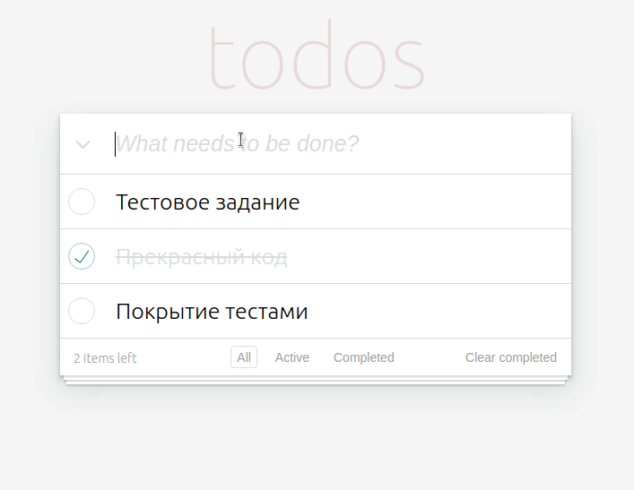

# todos

This project is a test assignment for a Junior Frontend developer.\
It is deployed at GitHub Pages and available at [dvalentina.github.io/todos/](https://dvalentina.github.io/todos/)



The application allows you to manage a list of todos. You can:
- add new todos
- check (or uncheck) the completed ones
- filter through list of all, uncompleted (active), and completed todos
- quickly clear the completed todos
- and also view the number of tasks that you still need to do.  

To learn what technologies were used to make this application and for additional comments read the end of this readme.

## If you want to run this application locally

Clone this repository to your computer.

> If you are not familiar with cloning GitHub repositories, check [GitHub Docs](https://docs.github.com/en/repositories/creating-and-managing-repositories/cloning-a-repository).

In the Terminal, go to the cloned project directory.

Run following command to install all necessary dependencies:

> If you don't have npm installed on your computer, follow [npm Docs](https://docs.npmjs.com/downloading-and-installing-node-js-and-npm) tutorial to install it.

```
npm i && npm run start
```

After that, your browser should automatically open a new tab and display the application. If it didn't happen, type
```
http://localhost:3000/
```
in the address bar of your browser.

You are now ready to explore the **todos** application!

## Tests

To start tests and get a coverage report, run following command:

```
npm run test:coverage
```

## Task

All requirements of the test task are met, namely:

- [x] The interface has an input for entering a new todo

- [x] There are separate lists for all todos, uncompleted (active) todos, and completed todos

- [x] The application is created with *TypeScript*, *React* and *React Hooks*

- [x] Key functionality is covered with tests

- [x] The project starts with running `npm i && npm run start` command

- [x] The project is deployed and available at GitHub Pages - [dvalentina.github.io/todos/](https://dvalentina.github.io/todos/)

- [x] The appearance of the application matches the given example:


## Tools & Technologies

In this project, I used [React](https://reactjs.org/) library for building a user interface and [Create-React-App](https://create-react-app.dev/) to start building an SPA.

The application's components were stylized with [styled-components](https://styled-components.com/).

Tests were written using [React Testing Library](https://testing-library.com/docs/react-testing-library/intro/).

The application runs on [Node.js](https://nodejs.org/en/) environment, and [npm](https://www.npmjs.com/) manages its packages.

For strong typing of JavaScript, I used [TypeScript](https://www.typescriptlang.org/).

To maintain the quality and the uniformity of the code, I relied on the help of [eslint](https://eslint.org/).

For debugging purposes, I used Chrome DevTools and [React Developer Tools](https://chrome.google.com/webstore/detail/react-developer-tools/fmkadmapgofadopljbjfkapdkoienihi).

For version control, I used [Git](https://git-scm.com/) & [GitHub](https://github.com/).

The project was deployed using [GitHub Pages](https://pages.github.com/).

## ✎ Some comments about development process 

✎ Since the example of the application's appearance was given in the image format, I have used **pixel perfect** browser extension to ensure maximum match between the example and the result. 

✎ I decided to not spend much time on finding the perfectly matching fonts, though, since it was not stated as necessary, and would consume a lot of time.

✎ Considering testing, **integration tests** were my main focus, since they check that components work properly together, and in a small app like this it provides enough confidence to not focus on testing different components in isolation. Strong typing with TypeScript and usage of ESLint provide an additional layer of confidence.

✎ There are different approaches to identifying elements on the webpage in testing, and in this application I decided to stick with using **data-testid** attribute, since it provides more reliable selectors, which helps to focus on testing the actual functionality of the app instead of components' implementation details

